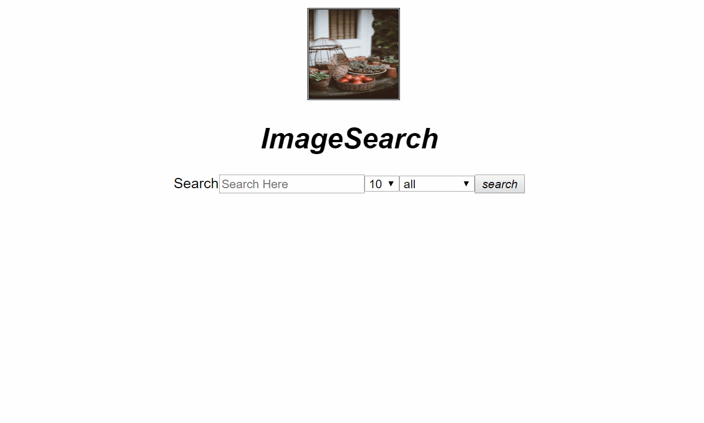

### Unsplash and react app
This app is made with javascript, react framework and unsplash api to let the user search for any images.

### How to use the app

- Users can search for images by typing in the search box and can also select the number of images and type of orientation from dropdown menu.

- If user types in something wrong "No images matches your result" message will be displayed on the page.

### How to install
- Clone/download this project 
- run npm install command in git bash to install all the dependencies
- run npm start to run the app
